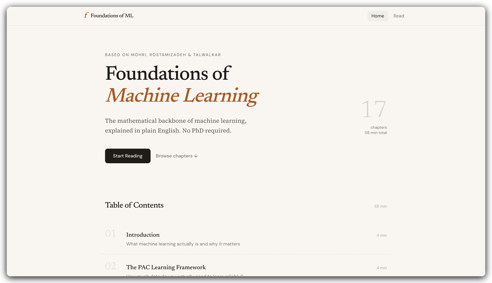
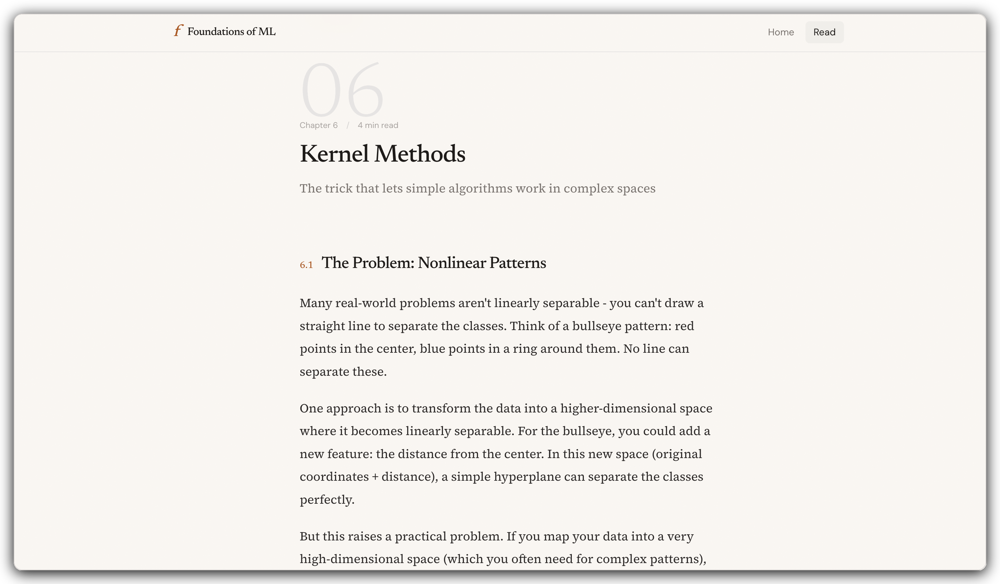
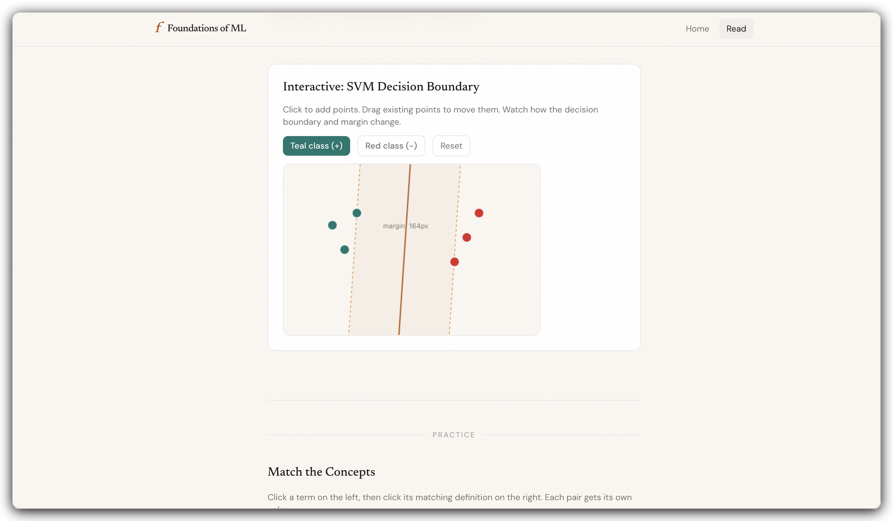

<h1 align="center">Foundations of Machine Learning</h1>

<p align="center">
  The mathematical backbone of machine learning, explained in plain English.<br/>
  No PhD required.
</p>

<p align="center">
  <a href="#features">Features</a> &middot;
  <a href="#chapters">Chapters</a> &middot;
  <a href="#getting-started">Getting Started</a> &middot;
  <a href="#contributing">Contributing</a> &middot;
  <a href="#license">License</a>
</p>

---

## What is this?

An open-source, interactive web textbook that distills [*Foundations of Machine Learning*](https://mitpress.mit.edu/9780262039406/foundations-of-machine-learning/) (2nd Edition) by Mohri, Rostamizadeh & Talwalkar into accessible, plain-English explanations. It's designed for anyone who wants to understand the *why* behind ML algorithms without wading through dense notation.

> **Not affiliated with the original authors or MIT Press.** This project rewrites the material for accessibility and adds interactive elements to support self-study.

<br/>

<p align="center">
  <picture>
    
  </picture>
</p>

<p align="center">
  <em>Clean, distraction-free reading experience</em>
</p>

<br/>

<p align="center">
  <picture>
    
  </picture>
  &nbsp;&nbsp;
  <picture>
    
  </picture>
</p>

<p align="center">
  <em>Chapter content with interactive visualizations and practice exercises</em>
</p>

<br/>

## Features

- **17 chapters** covering ML theory from PAC learning to reinforcement learning (~240 min total reading time)
- **Interactive SVM visualization** -- click to place points, drag to reposition, and watch the decision boundary update in real-time
- **Quizzes & matching exercises** -- test your understanding at the end of each chapter
- **Reading progress tracking** -- tracks which chapters you've visited and how far you've scrolled
- **Beautiful typography** -- Newsreader for headings, Source Serif 4 for body text, optimized for long-form reading
- **Fully responsive** -- sticky mobile navigation, hamburger menu, and adaptive layouts
- **Static generation** -- every chapter page is pre-rendered for instant loading
- **Open source** -- fork it, improve it, make it your own

## Chapters

| # | Title | Topic |
|---|-------|-------|
| 01 | Introduction | ML basics, problem types, generalization |
| 02 | The PAC Learning Framework | Probably Approximately Correct guarantees |
| 03 | Rademacher Complexity & VC-Dimension | Measuring hypothesis set complexity |
| 04 | Model Selection | Bias-variance tradeoff, cross-validation |
| 05 | Support Vector Machines | Maximum margin classifiers |
| 06 | Kernel Methods | The kernel trick & RKHS |
| 07 | Boosting | AdaBoost & margin theory |
| 08 | Online Learning | Experts problem, perceptron |
| 09 | Multi-Class Classification | OvA, OvO, error-correcting codes |
| 10 | Ranking | RankBoost, AUC optimization |
| 11 | Regression | Ridge, Lasso, sparsity |
| 12 | Maximum Entropy Models | Exponential family & density estimation |
| 13 | Conditional Maximum Entropy Models | Logistic & softmax regression |
| 14 | Algorithmic Stability | Stability-based generalization bounds |
| 15 | Dimensionality Reduction | PCA, kernel PCA, JL lemma |
| 16 | Learning Automata & Languages | L* algorithm, identification in the limit |
| 17 | Reinforcement Learning | MDPs, Q-learning, TD methods |

## Getting Started

### Prerequisites

- [Node.js](https://nodejs.org/) 18+
- npm (comes with Node.js)

### Installation

```bash
# Clone the repo
git clone https://github.com/adamfelkadi/foundations-of-ml.git
cd foundations-of-ml

# Install dependencies
npm install

# Start the dev server
npm run dev
```

Open [http://localhost:3000](http://localhost:3000) to start reading.

### Build for Production

```bash
npm run build
npm start
```

## Tech Stack

| Layer | Technology |
|-------|-----------|
| Framework | [Next.js 16](https://nextjs.org/) |
| Language | [TypeScript](https://www.typescriptlang.org/) |
| Styling | [Tailwind CSS 4](https://tailwindcss.com/) |
| Icons | [Material UI Icons](https://mui.com/material-ui/material-icons/) |
| Fonts | Newsreader, Source Serif 4, DM Sans, JetBrains Mono |
| Hosting | [Vercel](https://vercel.com/) |

## Contributing

Contributions are welcome! Here are some ways you can help:

- **Fix typos or improve explanations** -- clarity is everything for this project
- **Add quizzes and exercises** -- help readers test their understanding
- **Improve visualizations** -- interactive diagrams make abstract concepts click
- **Add new chapters or sections** -- expand the coverage
- **Report bugs** -- open an issue if something isn't working

### How to Contribute

1. Fork the repository
2. Create a feature branch (`git checkout -b feature/better-explanations`)
3. Make your changes
4. Run `npm run build` to verify everything compiles
5. Commit and push your changes
6. Open a Pull Request

## Deployment

This project is designed to be deployed on [Vercel](https://vercel.com/):

1. Push your repo to GitHub
2. Import the project on [vercel.com/new](https://vercel.com/new)
3. Vercel auto-detects Next.js -- just click Deploy

## License

This project is open source and available under the [MIT License](LICENSE).

---

<p align="center">
  A project by <a href="https://adamfelkadi.com">Adam El-Kadi</a>.
</p>
